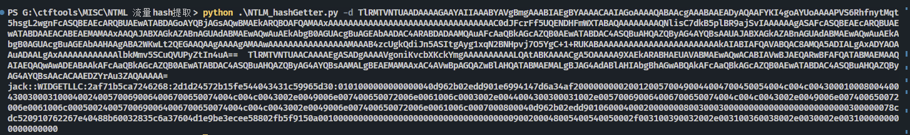

# NTLM_HashGetter

## 简述

最近 MISC 经常出 NTLM 流量相关的分析题，有的时候 Wireshark 没法进行完全解析，所以写了个工具来从协议内容中自动提取出 Hash 值，协议分析来自： 

[NTLM 协议详解]: https://rootclay.gitbook.io/ntlm/ntlm-ren-zheng-xie-yi-yu-ssp-shang#type-2-xiao-xi

## 工具用法

```
python .\NTLM_HashGetter.py -d NTLM_data1 NTLM_data2
```


